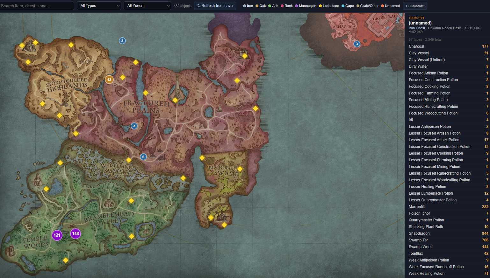

# RSDW Storage Map

An interactive storage-container map for **RuneScape: Dragonwilds**, built from live save files.

Click any marker on the map to see exactly what's inside that chest, rack, or lumber storage — item names, counts, and durability — refreshed directly from your save files.



---

## Features

- **Tile-based world map** stitched from in-game screenshots, rendered with Leaflet.js CRS.Simple
- **All storage types**: Iron/Oak/Ash/Personal Chests, Crates, Weapon Racks, Armour Mannequins, Cape Racks, Cape Hooks, Lumber Storages, Fishing Barrels, Tackle Boxes, Lodestones
- **Multi-world support**: switch between save slots (Cotswolds, Season1LetsPlay, Buff the Builder)
- **Live item names**: resolved from `guid_map.json` and an optional Master Checklist spreadsheet
- **Filter by type or zone**, search by item name or chest ID
- **↻ Refresh from save** button — re-parses your `.sav` files and reloads the map without leaving the browser
- **Accurate item assignment**: binary analysis of the save format; items assigned to the nearest preceding container in file space (handles multi-stack lumber correctly)

---

## Requirements

- **Python 3.9+**
- `pandas` and `openpyxl` (only needed if you use a Master Checklist for extra item name resolution)

```
pip install pandas openpyxl
```

---

## Setup

### 1. Clone the repo

```bash
git clone https://github.com/YOUR_USERNAME/rsdw-storage-map.git
cd rsdw-storage-map
```

### 2. Add your save files

Copy your RuneScape: Dragonwilds save files into the `Saved/SaveGames/` folder:

```
rsdw-storage-map/
└── Saved/
    └── SaveGames/
        ├── Cotswolds.sav
        ├── Season1LetsPlay.sav
        └── Buff the Builder.sav
```

Your saves are typically found at:
```
%LOCALAPPDATA%\Jagex\RuneScape Dragonwilds\Saved\SaveGames\
```

### 3. Add a Master Checklist (optional)

If you maintain a `Master_Checklist_RSDW_v2.xlsx` with an **Item ID Directory** sheet (columns: GUID | Display Name), place it in the root folder. The parser will use it to resolve any item GUIDs not covered by `guid_map.json`.

### 4. Run the map

Double-click **`Start_Map.bat`** (Windows), or run:

```bash
python server.py
```

Then open **http://localhost:8765/RSDW_Tile_Map.html** in your browser.

---

## Refreshing after playing

Click the **↻ Refresh from save** button in the toolbar. The server re-runs `parse_worlds.py` against your `.sav` files (~10–30 seconds) and reloads the map automatically.

You can also run the parser standalone at any time:

```bash
python parse_worlds.py
```

This writes `world_Cotswolds.json`, `world_Season1LetsPlay.json`, and `world_BuffTheBuilder.json` into the root folder.

---

## File structure

```
rsdw-storage-map/
├── RSDW_Tile_Map.html      # Main map (open via server, not file://)
├── parse_worlds.py         # Save file parser — generates world JSON files
├── server.py               # Local HTTP server with /refresh endpoint
├── Start_Map.bat           # Windows launcher (runs server.py)
├── guid_map.json           # Item GUID → name database (community data)
├── map_tiles/              # 8×8 grid of map tile PNGs
│   ├── 00.png … 77.png
│   └── ...
└── .gitignore
```

**Generated at runtime (not committed):**
```
world_Cotswolds.json
world_Season1LetsPlay.json
world_BuffTheBuilder.json
```

---

## How the parser works

The `.sav` file is a binary format. The parser:

1. Reads the **class table** at the start of the file to map class indices to storage type names
2. Scans for **SPWN** blocks (spawned building objects) and records their type, position in the file, and world coordinates (X/Y as 64-bit doubles)
3. Scans the file for **ItemData JSON blobs** — `{"GUID": "...", "ItemData": "...", "Count": N}` — embedded in the binary stream
4. Assigns each item blob to the **nearest preceding SPWN** in file space (binary analysis confirmed items always follow their container in file order)
5. Deduplicates by **instance GUID** so duplicate inventory copies don't inflate counts
6. Resolves item GUIDs to display names via `guid_map.json` and an optional Master Checklist

---

## Zone bounds

Zones are defined in `RSDW_Tile_Map.html` as `[xMin, xMax, yMin, yMax, yOffset, name]` in world-space coordinates. Edit the `ZONES` array to adjust or add zones as the game world expands.

Current zones: Dowdun, Dowdun Reach Base, West Dowdun, Bramblemead, Bramblemead Valley, Temple Woods, Fractured Plains, Bleakfields Valley, Coalridge Pass.

---

## Adding a new world save

In `parse_worlds.py`, add an entry to the `WORLDS` dict:

```python
WORLDS = {
    'Cotswolds':       'Cotswolds.sav',
    'Season1LetsPlay': 'Season1LetsPlay.sav',
    'BuffTheBuilder':  'Buff the Builder.sav',
    'MyNewWorld':      'MyNewWorld.sav',   # ← add here
}
```

Then add a `<option>` for it in the world selector in `RSDW_Tile_Map.html`.

---

## Notes on map tiles

The `map_tiles/` folder contains an 8×8 grid of PNG screenshots of the in-game world map, captured and stitched manually. These are cropped from RuneScape: Dragonwilds and are the property of Jagex. They are included here for personal/community reference only.

---

## Credits

- **[Elleandria/RS-Dragonwilds-Editor](https://github.com/Elleandria/RS-Dragonwilds-Editor)** — `guid_map.json` item GUID database, extracted from game assets via CUE4Parse. This project would not have working item names without that work.
- **[Dragonwilds Wiki](https://dragonwilds.runescape.wiki/)** — additional item reference data.
- **Jagex** — RuneScape: Dragonwilds. Map tiles are in-game screenshots included for personal/community reference only.
